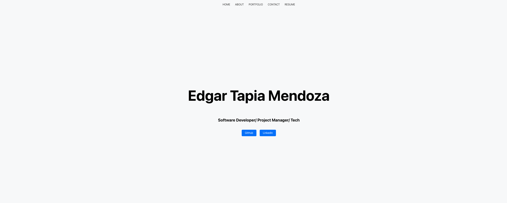

#REACT-PORTFOLIO

This project uses the following technologies:

- React
- JavaScript
- Node.js
- HTML/CSS
- Bootstrap

## Description

This is a single-page application portfolio designed to showcase projects and skills to potential employers and fellow developers, built using React.

## Table of Contents

- [Installation](#installation)
- [Usage](#usage)
- [Credits](#credits)
- [Tests](#tests)

## Installation

1.  Clone the repository.
2.  Install the required dependencies using the command npm install.
3.  Start the application using npm start.
4.  Open your browser and navigate to http://localhost:3000.

Review the code on the GitHub repository by visiting the [GitHub Repository](https://github.com/etapm/react-portfolio).

## Usage

1. Upon opening the application, a header, content, and footer are displayed.
2. The header holds my information and links to 'About Me', 'Portfolio', 'Contact', and 'Resume'.
3. Clicking these links scrolls to their respective sections without reloading the page.

   

4. Click on the button to add a new blog post and enter a title and contents for your post.

5. Click on the button to create the new blog post. It will be saved, and you will be redirected to an updated dashboard showing your new post.

6. In the dashboard, you can also delete or update your existing posts by clicking on the corresponding options.
7. To log out of the site, click on the "Log Out" option in the navigation.

## Credits

N/A

## License

This project is licensed under the ISC License.

## Badges

N/A

## Features
